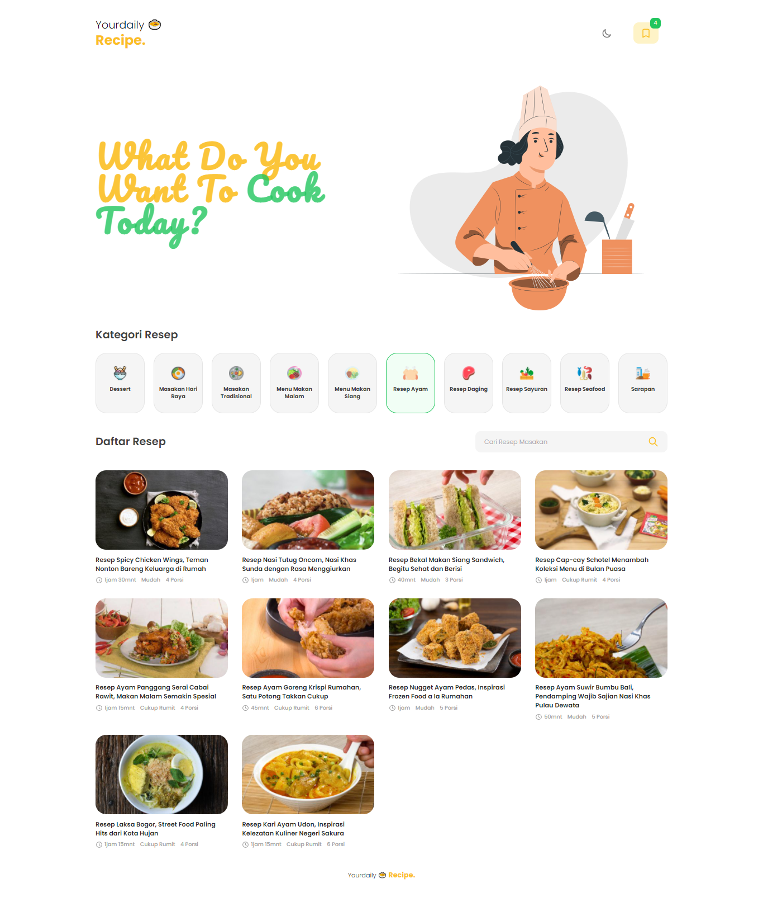

<h3 align="center">Yourdaily 🍲 Recipe.</h3>
<p align="center"> What do you want to cook today? </p>



### Description
Yourdaily Recipe adalah Website yang menyediakan kumpulan resep makanan khas Indonesia. <br><br>
Terdiri dari berbagai macam kategori makanan, Yourdaily Recipe menyediakan informasi bahan-bahan resep, cara penyajian, waktu penyajian juga tingkat kesulitan resep.

### Languages and Tools
- Vue Js
- Vue router
- Axios
- Tailwind Css
- Api Resep Masakan [https://github.com/tomorisakura/unofficial-masakapahariini-api]
- Google Font


### Project Setup
```
npm install
```

### Compiles and hot-reloads for development
```
npm run serve
```

### Compiles and minifies for production
```
npm run build
```

### Lints and fixes files
```
npm run lint
```

### Customize configuration
See [Configuration Reference](https://cli.vuejs.org/config/).
